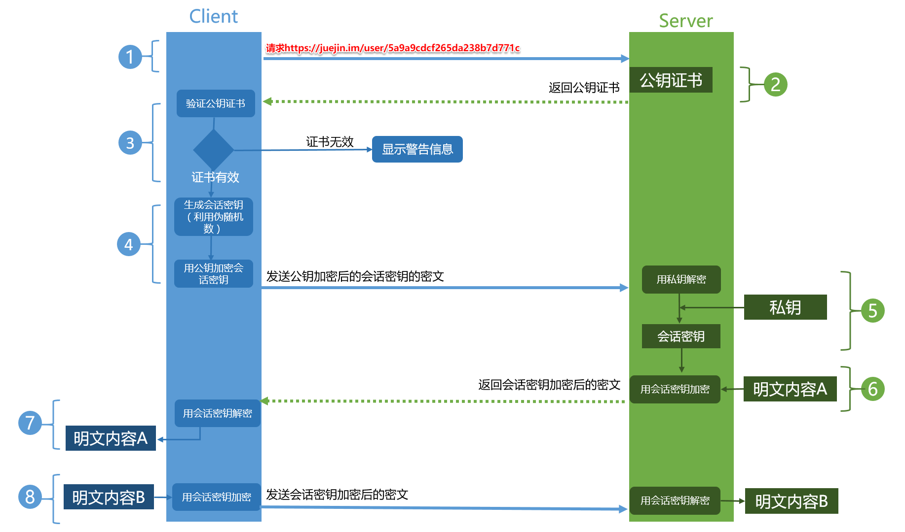

### <center>一更新文--http?</center>

来简单赘述下我认知范围内的HTTP。
其实很多人都像我一样，知道HTTP的模糊概念，但却无法追溯根源！
> 超文本传输协议（英语：HyperText Transfer Protocol，缩写：HTTP）是一种用于分布式、协作式和超媒体信息系统的应用层协议。HTTP是万维网的数据通信的基础。
设计HTTP最初的目的是为了提供一种发布和接收HTML页面的方法。通过HTTP或者HTTPS协议请求的资源由统一资源标识符（Uniform Resource Identifiers，URI）来标识。
HTTP的发展是由蒂姆·伯纳斯-李于1989年在欧洲核子研究组织（CERN）所发起。HTTP的标准制定由万维网协会（World Wide Web Consortium，W3C）和互联网工程任务组（Internet Engineering Task Force，IETF）进行协调，最终发布了一系列的RFC，其中最著名的是1999年6月公布的 RFC 2616，定义了HTTP协议中现今广泛使用的一个版本——HTTP 1.1。
2014年12月，互联网工程任务组（IETF）的Hypertext Transfer Protocol Bis（httpbis）工作小组将HTTP/2标准提议递交至IESG进行讨论，于2015年2月17日被批准。HTTP/2标准于2015年5月以RFC 7540正式发表，取代HTTP 1.1成为HTTP的实现标准。(额.. 就是一群人为了改变世界，搞了一个叫做熊孩子的组织，开始研究客户端和服务器之间的通信方法，然后提出了一个改变世界的方案，就开始协调的开发了一套协议标准，🦔HTTP)；

#### HTTP

- 语义
  - 请求只能由客户端发起，而服务器针对每个请求返回一个响应；
  - 请求与响应都由Header、Body（可选）组成，其中请求必须含有URL和方法，而响应必须含有响应码；
  - Header中各Name对应的含义保持不变。
- 概述
  - http呢，是一个客户端向服务器主动请求并与之应答的一个标准☝️，那么目前菜市场主要采用TCP协议为基础传输的协议层（3.0就改为🐂🍺的UDP了），然后通过浏览器、爬虫、主端等等一系列的工具呢发起一个http到另一侧服务器上（这时候默认端口80）。这时候只是http的发出只是代理此端（客户端）去向源服务器上请求一些资源（js，img，html...），在这两个端之间可能会出现很多个类似洋葱一样的中间层，比如 代理服务器啊。
  - 由HTTP客户端发起一个请求，创建一个到服务器指定端口（默认是80端口）的TCP连接。HTTP服务器则在那个端口监听客户端的请求。一旦收到请求，服务器会向客户端返回一个状态，比如"HTTP/1.1 200 OK"，以及返回的内容，如请求的文件、错误消息、或者其它信息。
- 报文组成部分
  - http报文：由请求报文和响应报文组成
    - 请求报文：由请求行、请求头、空行、请求体四部分组成
    - 响应报文：由状态行、响应头、空行、响应体四部分组成
      - 请求行：包含http方法，请求地址，http协议以及版本
      - 请求头/响应头：就是一些key:value来告诉服务端我要哪些内容，要注意什么类型等，请求头/响应头每一个字段详解
      - 空行：用来区分首部与实体，因为请求头都是key:value的格式，当解析遇到空行时，服务端就知道下一个不再是请求头部分，就该当作请求体来解析了
      - 请求体：请求的参数
      - 状态行：包含http协议及版本、数字状态码、状态码英文名称
      - 响应体：服务端返回的数据


- HTTP 请求方法
  |method|描述|
  |--|--|
  GET|获取资源
  POST|传输资源，通常会造成服务器资源的修改
  HEAD|获得报文首部
  PUT|更新资源
  PATCH|对PUT的补充，对已知资源部分更新
  DELETE|删除资源
  OPTIONS|列出请求资源支持的请求方法，用来跨域请求
  TRACE|追踪请求/响应路径，用于测试或诊断
  CONNECT|将连接改为管道方式用于代理服务器
- GET 和 POST 的区别
   1. GET在浏览器回退时是无害的，而POST会再次发起请求
   2. GET请求会被浏览器主动缓存，而POST不会，除非手动设置
   3. GET请求参数会被安逗保留在浏览器历史记录里，而POST中的参数不会被保留
   4. GET请求在URL中传递的参数有长度限制(浏览器限制大小不同)，而POST没有限制
   5. GET参数通过URL传递，POST放在Request body中
   6. GET产生的URL地址可以被收藏，而POST不可以
   7. GET没有POST安全，因为GET请求参数直接暴露在URL上，所以不能用来传递敏感信息
   8. GET请求只能进行URL编码，而POST支持多种编码方式
   9. 对参数的数据类型，GET只接受ASCII字符，而POST没有限制
   10. GET产生一个TCP数据包，POST产生两个数据包(Firefox只发一次)。GET浏览器把 http header和data一起发出去，响应成功200，POST先发送header，响应100 continue，再发送data，响应成功200
- 常见 HTTP 状态码
  - 1xx: 指示信息——表示请求已接收，继续处理
  - 2xx: 成功——表示请求已被成功接收
  - 3xx: 重定向——表示要完成请求必须进行进一步操作
  - 4xx: 客户端错误——表示请求有语法错误或请求无法实现
  - 5xx: 服务端错误——表示服务器未能实现合法的请求
- 正向代理和反向代理
  - 正向代理
    工作在客户端的代理为正向代理。使用正向代理的时候，需要在客户端配置需要使用的代理服务器，正向代理对服务端透明。比如抓包工具Fiddler、Charles以及访问一些外网网站的代理工具都是正向代理
    - 访问原来无法访问的资源，如google
    -  可以做缓存，加速访问资源
    -  对客户端访问授权，上网进行认证
    -  代理可以记录用户访问记录（上网行为管理），对外隐藏用户信息
  - 反向代理
    反向代理在电脑网络中是代理服务器的一种。服务器根据客户端的请求，从其关系的一组或多组后端服务器（如Web服务器）上获取资源，然后再将这些资源返回给客户端，客户端只会得知反向代理的IP地址，而不知道在代理服务器后面的服务器集群的存在
    - 对客户端隐藏服务器（集群）的IP地址
    - 安全：作为应用层防火墙，为网站提供对基于Web的攻击行为（例如DoS/DDoS）的防护，更容易排查恶意软件等
    - 为后端服务器（集群）统一提供加密和SSL加速（如SSL终端代理）
    - [负载均衡](https://zh.wikipedia.org/wiki/%E8%B4%9F%E8%BD%BD%E5%9D%87%E8%A1%A1)，若服务器集群中有负荷较高者，反向代理通过URL重写，根据连线请求从负荷较低者获取与所需相同的资源或备援
    - 对于静态内容及短时间内有大量访问请求的动态内容提供缓存服务
    - 减速上传
    - 为在私有网络下（如局域网）的服务器集群提供NAT穿透及外网发布服务 
        **常见代理软件**
    - Nginx、Tengine
    - Apache HTTP Server
    - Varnish cache
#### HTTP 0.9
过去式，只支持一种叫做“GET”的请求方式，没有在通讯中指定版本号，且不支持请求头。由于该版本不支持POST方法，因此客户端无法向服务器传递太多信息。
#### HTTP 1.0
这是第一个在通讯中指定版本号的HTTP协议版本。  
在这个版本里面，每次的request与response都要建立一次新的连接，这样就被称为“短连接”  
**Host域**    在HTTP1.0中认为每台服务器都绑定一个唯一的IP地址，因此，请求消息中的URL并没有传递主机名（hostname）。但随着虚拟主机技术的发展，在一台物理服务器上可以存在多个虚拟主机（Multi-homed Web Servers），并且它们共享一个IP地址。 
#### HTTP 1.1
**解决了什么问题？**
1. 增加keepAlive（长连接）`Connection:Keep-Alive`
2. 基于长连接的“管道化”，可以在同一TCP连接里，**同时发送**多个请求
   1. 只有GET请求和HEAD请求才可以进行管线化，而POST有所限制
   2. 初次创建连接时不应启动管线化机制，因为服务器不一定支持http1.1版本的协议
   3. 要求客户端和服务端都支持管线化，但并不要求服务端也对响应进行管线化处理，只是要求对于管线化的请求不失败即可
   4. 由于上面提到的服务端问题，开户管线化很可能并不会带来大幅度的性能提升，而且很多服务端和代理程序对管线化的支持并不好，因为浏览器(Chrome/Firefox)默认并未开启管线化支持
3. 增加了host域，最大的好多就是1Vn（一台物理机器有多个虚拟主机，并共享一个IP地址）
   1.  HTTP1.1的请求消息和响应消息都应支持Host头域，且请求消息中如果没有Host头域会报告一个错误（400 Bad Request）。此外，服务器应该接受以绝对路径标记的资源请求。
   2.  使用了虚拟网络，在一台物理服务器上可以存在多个虚拟主机，并且共享一个IP地址
4. 引入更多的请求方法类型PUT、PATCH、DELETE、OPTIONS、TRACE、CONNECT
5. 强化了缓存管理和控制Cache-Control、ETag/If-None-Match
6. 支持断点续传，通过使用请求头中的 **Range** 来实现。

*由于HTTP 1.0不支持Host请求头字段，WEB浏览器无法使用主机头名来明确表示要访问服务器上的哪个WEB站点，这样就无法使用WEB服务器在同一个IP地址和端口号上配置多个虚拟WEB站点。在HTTP 1.1中增加Host请求头字段后，WEB浏览器可以使用主机头名来明确表示要访问服务器上的哪个WEB站点，这才实现了在一台WEB服务器上可以在同一个IP地址和端口号上使用不同的主机名来创建多个虚拟WEB站点。*

**还存在啥问题？**
    1. 因为建立并复用TCP连接，在同一个连接，可以按顺序同时发送请求，这样就造成了堵塞问题。
    2. 传输的数据都是明文，双端没有办法确保安全性。
    3. keep-alive可能在不需要的时间内还仍旧存在。

#### HTTP 2
> 什么是SPDY？
> 是基于TCP的应用层协议，是HTTP2的前身之作，设计SPDY的目的在于降低网页的加载时间通过优先级和多路复用，SPDY使得只需要创建一个TCP连接即可传送网页内容及图片等资源。SPDY中广泛应用了TLS加密，传输内容也均以gzip或DEFLATE格式压缩（与HTTP不同，HTTP的头部并不会被压缩）。另外，除了像HTTP的网页服务器被动的等待浏览器发起请求外，SPDY的网页服务器还可以主动推送内容。http2主要基本SPDY。

解决了什么问题？
1. 实现无需先入先出的多路复用
    跟下面说的帧机制有关，http2采用每个流上面都存在一个流编号（Steam Id）有了这个，接收方就可以通过这个标识符去匹配相同的流编号。（避免了按顺序的直来直去，因此修复了队头堵塞问题）；
2. 强制性压缩（包括HTTP头部,**HPACK**算法 ）
3. **双向通讯** 服务器推送 允许服务器未经请求，主动向客户端发送资源，即服务器推送
4. **优先级排序** 可以设置数据帧的优先级，让服务端先处理重要资源，优化用户体验
5. 为简化客户端和服务器开发的消息——帧机制（二进制分帧）
   > 有别于HTTP/1.1在连接中的明文请求，HTTP/2与SPDY一样，将一个TCP连接分为若干个**流**（Stream），每个流中可以传输若干**消息**（Message），每个消息由若干最小的**二进制帧**（Frame）组成。这也是HTTP/1.1与HTTP/2最大的区别所在。HTTP/2中，每个用户的操作行为被分配了一个**流编号**（Stream ID），这意味着用户与服务端之间创建了一个TCP通道；协议将每个请求分割为二进制的控制帧与数据帧部分，以便解析。这个举措在SPDY中的实践表明，相比HTTP/1.1，新页面加载可以加快11.81%到47.7% 这回全都是01组合，可以出道了

#### HTTP 3？
wc，今天的“TCP”出现的次数是不是有点多了，应该多收点ta的出场费，在HTTP3的推崇下，逐渐也不再依赖或拘泥于TCP协议，而转变周知的UDP！
这个还没有正式的出现在人们视角内，直到2021年6月，HTTP3仍然是草案状态，[HTTP3简介](https://datatracker.ietf.org/doc/html/draft-ietf-quic-http-33)(2021年6月18日最后编辑)。[详情参见](https://quicwg-org.translate.goog/base-drafts/draft-ietf-quic-http.html?_x_tr_sl=en&_x_tr_tl=zh-CN&_x_tr_hl=zh-CN&_x_tr_pto=sc#name-delegation-to-quic)
完全是草案状态的抽象技术，为啥还要被问？我回答出来就会感觉良好？对前沿的求贤若渴？（个人意见）
- 解决的问题？
  - HTTP3基于UDP协议重新定义了连接，在QUIC层实现了无序、并发字节流的传输，解决了队头阻塞问题（包括基于QPACK解决了动态表的队头阻塞）；
  - HTTP3重新定义了TLS协议加密QUIC头部的方式，既提高了网络攻击成本，又降低了建立连接的速度（仅需1个RTT就可以同时完成建链与密钥协商）；
  - HTTP3 将Packet、QUIC Frame、HTTP3 Frame分离，实现了连接迁移功能，降低了5G环境下高速移动设备的连接维护成本。

- 委托给QUIC
- 基于UDP基础上
### HTTPS
>超文本传输安全协议, 组成：HTTP和SSL/TLS组合，默认端口 443，安全的所在就是SSL/TLS，主要依赖于三个算法`散列函数 、对称加密和非对称加密`
- 基于**对称密钥**的数据加密 加密和解密用同一个秘钥的加密方式叫做对称加密。客户端生成随机数作为会话密钥，并使用服务器公钥（服务器公钥在服务器证书中）加密会话密钥，最后将已加密的会话密钥发送给服务器。由服务器的私钥解密出会话密钥。最后使用此会话密钥加密数据。TLS也可以使用预共享密钥（PSK）作为对称密钥。（如果中间被人拦截咋整？）
- 基于**非对称密钥**的身份认证，通常是基于PKI证书的身份认证。服务器将其X.509证书发送给客户端，由客户端验证服务器的身份。如果服务器要验证客户端的证书，则客户端可能会将客户端证书发送给服务器。通常仅验证服务器，不验证客户端。 一个公钥和私钥，公钥只能由私钥解密，私密可以由任何公钥解密；公钥可以发送给所有的客户端，私钥只保存在服务器端。 [浪里行舟](https://juejin.cn/user/4283353031252967) 
多多少少对这个HTTP有些不耐烦。。。

### 缓存 （参见[掘金大佬沐华](https://juejin.cn/post/6993358764481085453)）
- DNS缓存
  接受到DNS的回馈后，会放进本地的储存器里面
- HTTP缓存
  - 强缓存
    第一次请求时，服务器把资源的过期时间通过响应头中的Expires和Cache-Control两个字段告诉浏览器，之后再请求这个资源的话，会判断有没有过期，没有过期就直接拿来用，不向服务器发起请求，这就是强缓存
    - Expires（用来指定资源到期绝对时间，服务器响应时，添加在响应头中。）
        ``` 
        Expires:Mon, 29 Jun 2020 11:10:23 GMT 
        这个方式有一个问题：「服务器的时间和浏览器的时间可能并不一致」，所以HTTP1.1提出新的字段代替它。
        ```  
    - Cache-Control
      HTTP1.1版本中，使用的就是该字段，这个字段采用的时间是过期时长，对应的是max-age。
      ```
      Cache-Control:max-age=6000
      ``` 
      注意点：
        1. 当Expires和Cache-Control同时存在时，优先考虑Cache-Control。
        2. 当然了，当缓存资源失效了，也就是没有命中强缓存，接下来就进入协商缓存👇

  - 协商缓存
    强缓存失效后，浏览器在请求头中携带响应的缓存Tag来向服务器发送请求，服务器根据对应的tag，来决定是否使用缓存;
    缓存分为两种，**「Last-Modified」** 和 **「ETag」**。两者各有优势，并不存在谁对谁有绝对的优势，与上面所讲的强缓存两个Tag所不同。   
    - Last-Modified (根据缓存最后时间来辨别)
      这个字段表示的是「最后修改时间」。在浏览器第一次给服务器发送请求后，服务器会在响应头中加上这个字段。
      浏览器接收到后，「如果再次请求」，会在请求头中携带If-Modified-Since字段，这个字段的值也就是服务器传来的最后修改时间。
      服务器拿到请求头中的If-Modified-Since的字段后，其实会和这个服务器中该资源的最后修改时间对比:
      -  如果请求头中的这个值小于最后修改时间，说明是时候更新了。返回新的资源，跟常规的HTTP请求响应的流程一样。
      - 否则返回304，告诉浏览器直接使用缓存。
    - ETag（根据文件是否相同来辨别）
        ETag是服务器根据当前文件的内容，对文件生成唯一的标识，比如MD5算法，只要里面的内容有改动，这个值就会修改，服务器通过把响应头把该字段给浏览器。
        浏览器接受到ETag值，会在下次请求的时候，将这个值作为「If-None-Match」这个字段的内容，发给服务器。
        服务器接收到「If-None-Match」后，会跟服务器上该资源的「ETag」进行比对
         - 如果两者一样的话，直接返回304，告诉浏览器直接使用缓存
         - 如果不一样的话，说明内容更新了，返回新的资源，跟常规的HTTP请求响应的流程一样
     - 如果两种方式都支持的话，服务器会优先考虑ETag
  - 缓存位置
    - Service Worker
        这个应用场景比如PWA，它借鉴了Web Worker思路，由于它脱离了浏览器的窗体，因此无法直接访问DOM。它能完成的功能比如：离线缓存、消息推送和网络代理，其中离线缓存就是「Service Worker Cache」。 
    - Memory Cache
        指的是内存缓存，从效率上讲它是最快的，从存活时间来讲又是最短的，当渲染进程结束后，内存缓存也就不存在了。 
    - Disk Cache
        存储在磁盘中的缓存，从存取效率上讲是比内存缓存慢的，优势在于存储容量和存储时长。
    - Disk Cache VS Memory Cache
        两者对比，主要的策略👇
        内容使用率高的话，文件优先进入磁盘
        比较大的JS，CSS文件会直接放入磁盘，反之放入内存。
    - Push Cache
        推送缓存，这算是浏览器中最后一道防线吧 
  - 总结
    - 首先检查Cache-Control， 尝鲜，看强缓存是否可用
    - 如果可用的话，直接使用
    - 否则进入协商缓存，发送HTTP请求，服务器通过请求头中的If-Modified-Since或者If-None-Match字段检查资源是否更新
    - 资源更新，返回资源和200状态码。
    - 否则，返回304，直接告诉浏览器直接从缓存中去资源。

### Other 
 - 霍夫曼编码
   > 霍夫曼编码使用变长编码表对源符号（如文件中的一个字母）进行编码，其中变长编码表是通过一种评估来源符号出现概率的方法得到的，出现概率高的字母使用较短的编码，反之出现概率低的则使用较长的编码，这便使编码之后的字符串的平均长度、期望值降低，从而达到无损压缩数据的目的。
   例如，在英文中，e的出现概率最高，而z的出现概率则最低。当利用霍夫曼编码对一篇英文进行压缩时，e极有可能用一个比特来表示，而z则可能花去25个比特（不是26）。用普通的表示方法时，每个英文字母均占用一个字节，即8个比特。二者相比，e使用了一般编码的1/8的长度，z则使用了3倍多。倘若我们能实现对于英文中各个字母出现概率的较准确的估算，就可以大幅度提高无损压缩的比例。

 - 比特（英语：Bit，亦称二进制位）指二进制中的一位，是信息的最小单位

### 参见
- [HTTP3](https://zh.wikipedia.org/wiki/HTTP/3)；
- [QUIC-HTTP3](https://quicwg-org.translate.goog/base-drafts/draft-ietf-quic-http.html?_x_tr_sl=en&_x_tr_tl=zh-CN&_x_tr_hl=zh-CN&_x_tr_pto=sc#name-delegation-to-quic)
- [HTTP协议](https://www.ibm.com/docs/en/cics-ts/5.1?topic=concepts-http-protocol)
- [HTTP1.1](https://www.ietf.org/rfc/rfc2616.txt)
- [HPACK](https://datatracker.ietf.org/doc/html/rfc7541)
- [HPACK--blog](https://halfrost.com/http2-header-compression/)
- [稀土掘金沐华](https://juejin.cn/post/6857287743966281736#heading-31)

顺便说一下子这个域名和解析之后的IP地址，到底是个啥？ 我们都知道同源策略，实然协议+主机+端口，或者还有四元组、五元组，协议和主机可以看为一个物件，在这个提供n（0-2的16次方）的端口号来分配到n个物件，相当于1对n个，这可能也是分布式的鬼东西吧。