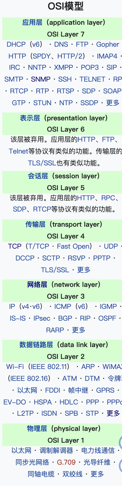
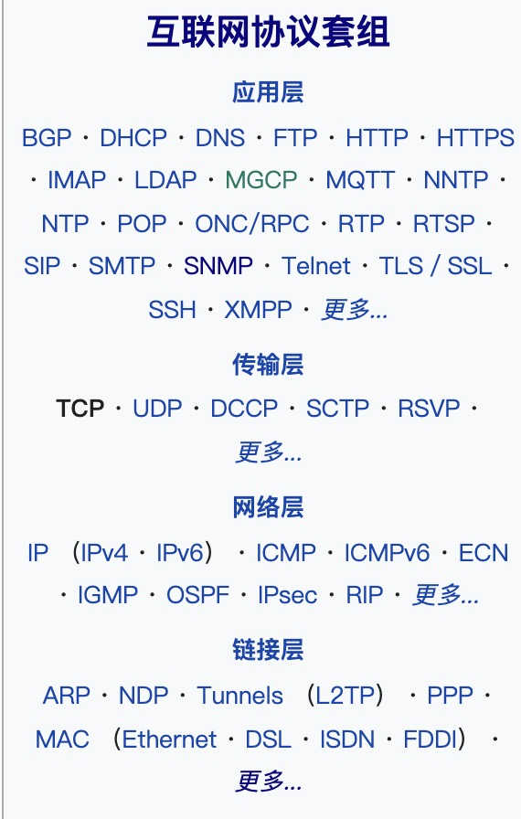
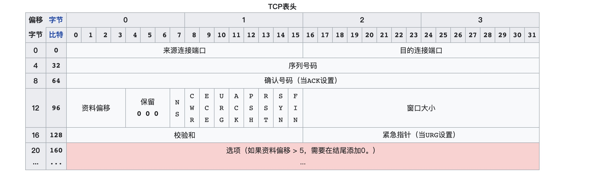
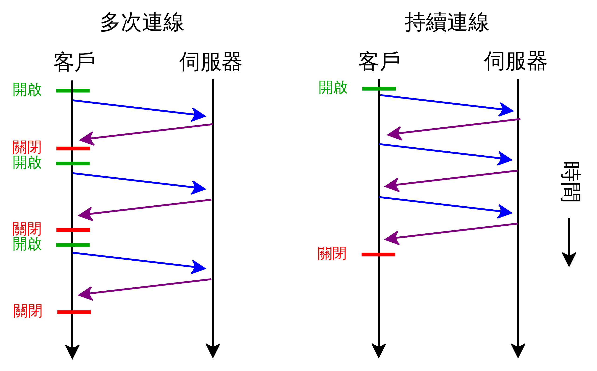

### <center>一更新文--做个简单的复习（标题待定）</center>

### Ajax: 
&nbsp; 次次的重温，不可能只是单纯的做复习吧。
XMLHttpRequest(XHR)； 对象用于对服务器的交互。通过这个玩意可以在不刷新页面的情况下发送请求特定的URL

### Fetch: 


### TCP/IP
- 同源策略 ：  
    &nbsp; &nbsp;是一个重要的安全策略，它用于限制一个origin的文档或者它加载的脚本如何能与另一个源的资源进行交互。它能帮助阻隔恶意文档，减少可能被攻击的媒介。  
    &nbsp; &nbsp;何为同源？  **其最简单的回答就是：协议/域名/端口；**   
准确的话术应该是：协议/<font color=#0099ff >主机</font>/<font color=#0099ff>端口元组</font>；
    - 四元组： 源IP地址、目的IP地址、源端口、目的端口;  
    - 五元组： 源IP地址、目的IP地址、协议号、源端口、目的端口;  
    - 七元组： 源IP地址、目的IP地址、协议号、源端口、目的端口、服务类型、接口索引;

- 同源策略的限制  :
  1. Cookie 、LocalStorage 和 IndexDB无法读取
  2. 无法获取或操作另一个资源的DOM (iframe)
  3. AJAX请求不能发送
   
| URL                                             | 姐果 | 因因                             |
| ----------------------------------------------- | ---- | -------------------------------- |
| http://store.company.com/dir2/other.html        | 同源 | 只有路径不同                     |
| http://store.company.com/dir/inner/another.html | 同源 | 只有路径不同                     |
| https://store.company.com/secure.html           | 失败 | 协议不同                         |
| http://store.company.com:81/dir/etc.html        | 失败 | 端口不同 ( http:// 默认端口是80) |
| http://news.company.com/dir/other.html          | 失败 | 主机不同                         |

- CORS:  
&emsp;跨源资源共享 (CORS)（或通俗地译为跨域资源共享）是一种基于 HTTP 头的机制，该机制通过允许服务器标示除了它自己以外的其它origin（域，协议和端口），这样浏览器可以访问加载这些资源。跨源资源共享还通过一种机制来检查服务器是否会允许要发送的真实请求，该机制通过浏览器发起一个到服务器托管的跨源资源的"预检"请求。在预检中，浏览器发送的头中标示有HTTP方法和真实请求中会用到的头。


    *前端设置origin地址，后端设置是允许被跨域访问通配符或指定地址；*

- **OPTIONS：**  
&emsp;对那些可能对服务器数据产生副作用的 HTTP 请求方法（特别是 GET 以外的 HTTP 请求，或者搭配某些 MIME类型 的 POST 请求），浏览器必须首先使用 OPTIONS 方法发起一个预检请求（preflight request），从而获知服务端是否允许该跨源请求。服务器确认允许之后，才发起实际的 HTTP 请求。在预检请求的返回中，服务器端也可以通知客户端，是否需要携带身份凭证（包括 Cookies 和 HTTP认证 相关数据）。   

- **简单请求** 

    &emsp;某些请求不会出发Cors预检请求。该术语不属于Fetch（fetch自己里面定义了cors的规范，若请求 **满足所有下述条件**，则该请求可视为“简单请求”；
  1. 使用下列方法之一：
      - GET
      - HEAD
      - POST
  2. 请求的Heder是
      - Accept
      - Accept-Language
      - Content-Language
      - Content-Type 
  3. Content-Type 的值仅限于下列三者之一：
     - text/plain
     - multipart/form-data
     - application/x-www-form-urlencoded

    请求头字段Origin应该标明该请求源于哪里`Origin: http://www.baidu.com`
    > GET /resources/public-data/ HTTP/1.1   
Host: bar.other  
User-Agent: Mozilla/5.0 (Macintosh; Intel Mac OS X 10.14; rv:71.0) Gecko/20100101 Firefox/71.0  
Accept: text/html,application/xhtml+xml,application/xml;q=0.9,*/*;q=0.8  
Accept-Language: en-us,en;q=0.5  
Accept-Encoding: gzip,deflate  
Connection: keep-alive  
Origin: http://www.baidu.com

    &emsp;而响应头部则应该设置`Access-Control-Allow-Origin: *`表明，该资源可以被 任意 外域访问
    >HTTP/1.1 200 OK  
Date: Mon, 01 Dec 2008 00:23:53 GMT  
Server: Apache/2  
Access-Control-Allow-Origin: *  
Keep-Alive: timeout=2, max=100  
Connection: Keep-Alive  
Transfer-Encoding: chunked  
Content-Type: application/xml  

    使用 Origin 和 Access-Control-Allow-Origin 就能完成最简单的访问控制。如果服务端仅允许来自 http://www.baidu.com 的访问，该首部字段的内容如下：
    > Access-Control-Allow-Origin: http://www.baidu.com

- **预检请求**

    &emsp;与上述简单请求不同， 预检请求是要在真实的请求之前发送一个options的请求，已获得服务器返回的是否可以世纪的请求，“预检请求”的使用 可以避免浏览器和服务器产生未预测的影响。  
`现在需要执行一下HTTP请求`
    > const xhr = new XMLHttpRequest();  
xhr.open('POST', 'https://bar.other/resources/post-here/');  
xhr.setRequestHeader('X-PINGOTHER', 'pingpong');  
xhr.setRequestHeader('Content-Type', 'application/xml');  
xhr.onreadystatechange = handler;  
xhr.send('<person><name>Arun</name></person>');

上面的代码使用 POST 请求发送一个 XML 文档，该请求包含了一个自定义的请求首部字段（X-PINGOTHER: pingpong）。另外，该请求的 Content-Type 为 application/xml。因此，该请求需要首先发起“预检请求”。

&emsp;图上所述， 首先发起的OPTIONS带有两个字段：Access-Control-Request-*（Method｜Headers），实际的post请求是不会携带这两个参数的。  
&emsp;检测之后会发送是实际请求；
&emsp;`Access-Control-Max-Age 看文章尾部信息。`

- **withCredentials（携带cookie）**
    ```js
        // 携带凭证（cookie）
        const invocation = new XMLHttpRequest();
        invocation.withCredentials = true; // 凭证开启
        //响应头部字段： Access-Control-Allow-Credentials: true
    ```
    预检请求和Cookie
    CORS 预检请求不能包含Cookie。预检请求的 响应 必须指定Access-Control-Allow-Credentials: true 来表明可以携带凭据进行实际的请求。
  
### 计算机网络模型
> 计算机网络的各层及其协议的集合被称为网络的体系结构，按照不同的维度，其常被分为七层、五层、四层网络结构：（每个中间层为其上一层提供功能，其自身功能则由其下一层提供）
- 七层网络模型（OSI 模型）
    >PS: 开放式系统互联模型（英语：Open System Interconnection Model，缩写：OSI；简称为OSI模型）是一种概念模型，由国际标准化组织提出，一个试图使各种计算机在世界范围内互连为网络的标准框架。定义于ISO/IEC 7498-1。  
    - 应用层（第七层）这一层我们都太熟悉不过了。
      > 提供为应用软件而设计的接口，以设置与另一应用软件之间的通信。例如：HTTP、HTTPS、FTP、Telnet、SSH、SMTP、POP3等
    - 表示层（第六层）
      > 负责数据转换为能与接收者的系统格式兼容并适合传输的格式，比如字符编码与转换，以及数据加密。 
    - 会话层(负责建立、维持和终止会话)（第五层）
      > 会话要建立在两个特定的用户之间的连接， 请求信息称为客户端，被请求信息应用称为服务器；根据所采用的协议，会话可能会启动各种故障解决程序。根据所使用的应用程序/协议/硬件，会话可能支持单工，半双工或全双工模式。这层协议主项为网络基本输入输出系统（NetBIOS）和远程过程调用协议（RPC）等等
      这层可能会出现的问题：  
        1. 服务器不可用
        2. 服务器未被正确地配置，例如 Apache 或 PHP 配置
        3. 会话故障——断连、超时，等等
    - 传输层（第四层）
       > 最有名的两个协议是传输控制协议(TCP)和用户数据报协议(UDP);传输层通过将消息分割成多个数据包提供端到端的消息传输，支持面向连接的和无连接的通信。以及、SCTP、SPX、ATP、IL等等。
       可能会出现的问题：  
        1. 被封锁的端口——检查你的访问控制列表（ACL，Access Control List）和防火墙
        2. 服务质量。
    - 网络层（第三层）
      > 有时也译为网际层，它负责为两台主机提供通信服务，并通过选择合适的路由将数据传递到目标主机。 例如IP、ICMP、IPX、BGP、OSPF、RIP、IGRP、EIGRP、ARP、RARP、X.25
      可能会出现的问题  
        1. IP 地址配置不正确
        2. 路由器或其它节点故障或无功能
    - 数据链路层（第二层）
      > 数据链路层允许局域网内的各节点彼此相互通信。这一层建立了线路规划、流量控制和错误控制的基础。 例如以太网、令牌环、HDLC、帧中继、ISDN、ATM、IEEE 802.11、FDDI、PPP
        可能会出现的问题  
        1. 两个节点间的连接（会话）不成功
        2. 帧冲突
        3. 成功建立但又间歇性失败的会话
    - 物理层（第一层）
        > 在局域网上发送数据帧（Data Frame），它负责管理电脑通信设备和网络媒体之间的互通。包括了针脚、电压、线缆规范、集线器、中继器、网卡、主机接口卡等。
        会出现的问题  
        1. 设备故障
        2. 电缆无效？
        3. 等等（82年大头电脑...）
- 四层网络模型（IPS）
    > PS: 互联网协议套件（英语：Internet Protocol Suite，缩写IPS）是网络通信模型，以及整个网络传输协议家族，为网际网络的基础通信架构。它常通称为TCP/IP协议族（英语：TCP/IP Protocol Suite，或TCP/IP Protocols），简称TCP/IP;   
- 五层网络模型（TCP）
  - 应用层
  - 传输层
  - 网络层
  - 数据连接层
  - 物理层


- DNS如何解析成数字IP？
    ‘
    1. 用户打开 Web 浏览器，在地址栏中输入 www.example.com，然后按 Enter 键。  
    2. www.example.com 的请求被路由到 DNS 解析程序，这一般由用户的互联网服务提供商 (ISP) 进行管理，例如有线 Internet 服务提供商、DSL 宽带提供商或公司网络。
    3. ISP 的 DNS 解析程序将 www.example.com 的请求转发到 DNS 根名称服务器。
    4. ISP 的 DNS 解析程序再次转发 www.example.com 的请求，这次转发到 .com 域的一个 TLD 名称服务器。.com 域的名称服务器使用与 example.com 域相关的四个 Amazon Route 53 名称服务器的名称来响应该请求。
    5. ISP 的 DNS 解析程序选择一个 Amazon Route 53 名称服务器，并将 www.example.com 的请求转发到该名称服务器。
    6. Amazon Route 53 名称服务器在 example.com 托管区域中查找 www.example.com 记录，获得相关值，例如，Web 服务器的 IP 地址 (192.0.2.44)，并将 IP 地址返回至 DNS 解析程序。
    7. ISP 的 DNS 解析程序最终获得用户需要的 IP 地址。解析程序将此值返回至 Web 浏览器。DNS 解析程序还会将 example.com 的 IP 地址缓存 (存储) 您指定的时长，以便它能够在下次有人浏览 example.com 时更快地作出响应。有关更多信息，请参阅存活期 (TTL)。
    8. Web 浏览器将 www.example.com 的请求发送到从 DNS 解析程序中获得的 IP 地址。这是您的内容所处位置，例如，在 Amazon EC2 实例中或配置为网站端点的 Amazon S3 存储桶中运行的 Web 服务器。
    9. 192.0.2.44 上的 Web 服务器或其他资源将 www.example.com 的 Web 页面返回到 Web 浏览器，且 Web 浏览器会显示该页面。


- TCP数据包结构
  > 先看一下TCP的数据结构这张消息豹纹（报文）表格看起来的确很复杂，我们由左到右，由上到下看；每一行都有32个序号，而32个序号等于4个字节；下面简单理解数据包结构，主要理解ACK、ack、SYN、FIN；
  - 来源连接端口（16位长）－识别发送连接端口
  - 目的连接端口（16位长）－识别接收连接端口
  - 序列号（seq，32位长）
      - 如果含有同步化旗标（SYN），则此为最初的序列号；第一个资料比特的序列码为本序列号加一。
      - 如果没有同步化旗标（SYN），则此为第一个资料比特的序列码。
  - 确认号（ack，32位长）—期望收到的数据的开始序列号。也即已经收到的数据的字节长度加1。
  - 资料偏移（4位长）—以4字节为单位计算出的数据段开始地址的偏移值。
  - 保留（3比特长）—须置0
  - 标志符（9比特长）
      - NS—ECN-nonce。ECN显式拥塞通知（Explicit Congestion Notification）是对TCP的扩展，定义于 RFC 3540 （2003）。ECN允许拥塞控制的端对端通知而避免丢包。ECN为一项可选功能，如果底层网络设施支持，则可能被启用ECN的两个端点使用。在ECN成功协商的情况下，ECN感知路由器可以在IP头中设置一个标记来代替丢弃数据包，以标明阻塞即将发生。数据包的接收端回应发送端的表示，降低其传输速率，就如同在往常中检测到包丢失那样。
      - CWR—Congestion Window Reduced，定义于 RFC 3168（2001）。
      - ECE—ECN-Echo有两种意思，取决于SYN标志的值，定义于 RFC 3168（2001）。
      - URG—为1表示高优先级数据包，紧急指针字段有效。
      - ACK—为1表示确认号字段有效
      - PSH—为1表示是带有PUSH标志的数据，指示接收方应该尽快将这个报文段交给应用层而不用等待缓冲区装满。
      - RST—为1表示出现严重差错。可能需要重新创建TCP连接。还可以用于拒绝非法的报文段和拒绝连接请求。
      - SYN—为1表示这是连接请求或是连接接受请求，用于创建连接和使顺序号同步
      - FIN—为1表示发送方没有数据要传输了，要求释放连接。
  - 窗口（WIN，16位长）—表示从确认号开始，本报文的发送方可以接收的字节数，即接收窗口大小。用于流量控制。
  - 校验和（Checksum，16位长）—对整个的TCP报文段，包括TCP头部和TCP数据，以16位字进行计算所得。这是一个强制性的字段。
  - 紧急指针（16位长）—本报文段中的紧急数据的最后一个字节的序号。
  - 选项字段—最多40字节。每个选项的开始是1字节的kind字段，说明选项的类型。  
      0：选项表结束（1字节）  
      1：无操作（1字节）用于选项字段之间的字边界对齐。  
      2：最大报文段长度（4字节，Maximum Segment Size，MSS）通常在创建连接而设置SYN标志的数据包中指明这个选项，指明本端所能接收的最大长度的报文段。通常将MSS设置为（MTU-40）字节，携带TCP报文段的IP数据报的长度就不会超过MTU（MTU最大长度为1518字节，最短为64字节），从而避免本机发生IP分片。只能出现在同步报文段中，否则将被忽略。  
      3：窗口扩大因子（3字节，wscale），取值0-14。用来把TCP的窗口的值左移的位数，使窗口值乘倍。只能出现在同步报文段中，否则将被忽略。这是因为现在的TCP接收数据缓冲区（接收窗口）的长度通常大于65535字节。  
      4：sackOK—发送端支持并同意使用SACK选项。  
      5：SACK实际工作的选项。  
      8：时间戳（10字节，TCP Timestamps Option，TSopt）  
        &emsp; 1. 发送端的时间戳（Timestamp Value field，TSval，4字节）  
        &emsp; 2.  时间戳回显应答（Timestamp Echo Reply field，TSecr，4字节）  
      19：MD5摘要，将TCP伪首部、校验和为0的TCP首部、TCP数据段、通信双方约定的密钥（可选）计算出MD5摘要值并附加到该选项中，作为类似对TCP报文的签名。通过 RFC 2385 引入，主要用于增强BGP通信的安全性。
      29：安全摘要，通过 RFC 5925 引入，将“MD5摘要”的散列方法更换为SHA散列算法。
  
- 三次握手
  看完上面这个，就很容易去了解三次挥手和四次握手了；  其实这里面主要掌握几个上述的字段，SYN、FIN、ack、ACK。
  > 被动打开：一对终端同时初始化一个它们之间的连接是可能的。但通常是由一端（服务器端）打开一个套接字（socket）然后监听来自另一方（客户端）的连接，这就是通常所指的被动打开（passive open）。服务器端被被动打开以后，客户端就能开始创建主动打开（active open）。
  
  图上就是很简单的表示出来；
    1. 连接的开始由客户端向服务器发送一个SYN包，请求一个主动打开，该包里会携带客户端随机生成的序列号（seq）；
    2. 服务器端收到一个合法的SYN包后，把该包放入SYN队列中；回送一个SYN/ACK。ACK的确认码应为A+1，SYN/ACK包本身携带一个随机产生的序号B。
    3. 客户端收到SYN/ACK包后，发送一个ACK包，该包的序号被设定为A+1，而ACK的确认码则为B+1。然后客户端的connect函数成功返回。当服务器端收到这个ACK包的时候，把请求帧从SYN队列中移出，放至ACCEPT队列中；这时accept函数如果处于阻塞状态，可以被唤醒，从ACCEPT队列中取出ACK包，重新创建一个新的用于双向通信的sockfd，并返回。
        **注意下面使用字段区别，小写ack代表标识符中ack（此只是1位序号），大写ACK为“确认序号”**  
        | 次数   | 内容                            | 方向               |
        | ------ | ------------------------------- | ------------------ |
        | 第一次 | SYN=1，seq=10000                | 客户端向服务端发送 |
        | 第二次 | SYN=1,seq=10001,ack=1,ACK=20000 | 服务端向客户端发送 |
        | 第三次 | ACK=20001,ack=1                 | 客户端发回服务端   |
    > ⚠️  如果服务器端接到了客户端发的SYN后回了SYN-ACK后客户端掉线了，服务器端没有收到客户端回来的ACK，那么，这个连接处于一个中间状态，既没成功，也没失败。于是，服务器端如果在一定时间内没有收到的TCP会重发SYN-ACK。在Linux下，默认重试次数为5次，重试的间隔时间从1s开始每次都翻倍，5次的重试时间间隔为1s, 2s, 4s, 8s, 16s，总共31s，第5次发出后还要等32s才知道第5次也超时了，所以，总共需要 1s + 2s + 4s+ 8s+ 16s + 32s = 63s，TCP才会断开这个连接。使用三个TCP参数来调整行为：tcp_synack_retries 减少重试次数；tcp_max_syn_backlog，增大SYN连接数；tcp_abort_on_overflow决定超出能力时的行为。

- 四次握手
    
    这一侧每一个都可以独立向对侧发出FIN，对侧回应ACK表示确认。此时的序列号（seq）不是随机生成，而是由增长的来计算。  
        **注意下面使用字段区别，小写ack代表标识符中ack（此只是1位序号），大写ACK为“确认序号”**  

    | 次数   | 内容            | 方向               |
    | ------ | --------------- | ------------------ |
    | 第一次 | FIN=1,seq=32145 | 客户端向服务器发送 |
    | 第二次 | ACK=32146,ack=1 | 服务器向客户端发送 |
    | 第三次 | FIN=1,ACK=10332 | 服务器向客户端发送 |
    | 第四次 | ack=1,ACK=10333 | 客户端向服务器发送 |

> 为什么是三次握手？
    <font color=orang>因为TCP的特点，安全的连接和安全的保证数据，所以要保证每端都要有两次的确认才能够互相相信。<font color=#0645ad>好吧，来看看官方大大给的解释：“三次握手”的目的是“为了防止已失效的连接(connect)请求报文段传送到了服务端，因而产生错误”，也即为了解决“网络中存在延迟的重复分组”问题。例如：client发出的第一个连接请求报文段并没有丢失，而是在某个网络结点长时间的滞留了，以致延误到连接释放以后的某个时间才到达server。本来这是一个早已失效的报文段。但server收到此失效的连接请求报文段后，就误认为是client发出的一个新的连接请求。于是就向client发出确认报文段，同意创建连接。假设不采用“三次握手”，那么只要server发出确认，新的连接就创建了。由于现在client并没有发出创建连接的请求，因此不会理睬server的确认，也不会向server发送数据。但server却以为新的运输连接已经创建，并一直等待client发来数据。这样，server的很多资源就白白浪费掉了。采用“三次握手”的办法可以防止上述现象发生，client不会向server的确认发出确认。server由于收不到确认，就知道client并没有要求创建连接。</font></font>

> 为什么是四次挥手？
    简单理解就是双方都是准备好的情况下，没侧发送的第一个FIN称准备好了，但是又不具备直接断开的条件，万一 一方准备另一方又来了新消息呢？只有双方全部确认好并返回给相应的ack的时候，才可以保证他的性质（安全链接，安全信息发送）。
    其实断开的时候也有可能是这样子，看表格⬇️  

| 次数   | 内容            | 方向                 |
| ------ | --------------- | -------------------- |
| 第一次 | FIN=1,seq=32145 | 客户端向服务器发送   |
| 第二次 | ACK=32146,ack=1 | 服务器向客户端发送   |
| 第三次 | DATA            | 服务器发送客户端信息 |
| 第四次 | FIN=1,ACK=10332 | 服务器向客户端发送   |
| 第五次 | ack=1,ACK=10333 | 客户端向服务器发送   |
#### H5 Q2 (过段时间再看)。
### 预检请求字段与其他相关字段：(Response)
|               key                |           value           |                                               explain                                                |
| :------------------------------: | :-----------------------: | :--------------------------------------------------------------------------------------------------: |
|  Access-Control-Request-Method   |         POST,GET          | 说明服务器允许客户端使用 POST 和 GET 方法发起请求（与 Allow 响应首部类似，但其具有严格的访问控制）。 |
|  Access-Control-Request-Headers  | X-PINGOTHER, Content-Type |                       表明服务器允许请求中携带字段 X-PINGOTHER 与 Content-Type                       |
|      Access-Control-Max-Age      |           86400           |           表明该响应的有效时间为86400秒，也就是24小时，有效时间内无需发送第二次预检请求。            |
|   Access-Control-Allow-Origin    |     * \| 单个 \| 列表     |           可以允许哪些客户端来访问，指可以是*，也可以是某个域名或者用逗号隔开的域名列表。            |
|  Access-Control-Expose-Headers   |             -             |                                      浏览器可以访问的一些头部。                                      |
| Access-Control-Allow-Credentials |          boolean          |   表示是否允许发送Cookie；。这个值也只能设为true，如果服务器不要浏览器发送Cookie，删除该字段即可。   |

### HTTP 请求首部字段：(Request)
|              key               |          value          |                                                                                explain                                                                                 |
| :----------------------------: | :---------------------: | :--------------------------------------------------------------------------------------------------------------------------------------------------------------------: |
|             Origin             |           URI           | origin 参数的值为源站 URI。它不包含任何路径信息，只是服务器名称; <font color=#ccc>PS:有时候将该字段的值设置为空字符串是有用的，例如，当源站是一个 data URL 时。</font> |
| Access-Control-Request-Method  |         method          |                                                首部字段用于预检请求。其作用是，将实际请求所使用的 HTTP 方法告诉服务器。                                                |
| Access-Control-Request-Headers | field-name[,field-name] |                                                 首部字段用于预检请求。其作用是，将实际请求所携带的首部字段告诉服务器。                                                 |

### Other 
1. HTTP keep-alive和 TCP keep-alive的区别?
    - TCP keep-alive
        >指的是TCP保活计时器（keepalive timer）。设想有这样的情况：客户已主动与服务器建立了TCP连接。但后来客户端的主机突然出故障。显然，服务器以后就不能再收到客户发来的数据。因此，应当有措施使服务器不要再白白等待下去。这就是使用保活计时器。服务器每收到一次客户的数据，就重新设置保活计时器，时间的设置通常是两小时。若两小时没有收到客户的数据，服务器就发送一个探测报文段，以后则每隔75秒发送一次。若一连发送10个探测报文段后仍无客户的响应，服务器就认为客户端出了故障，接着就关闭这个连接。
        ——摘自谢希仁《计算机网络》[WIKI文献](https://zh.wikipedia.org/wiki/Keepalive)。
        ```
        sudo sysctl -a | grep keepalive
        // 每隔 7200 s 检测一次; 存活时长即空闲时，两次传输存活包的持续时间。TCP存活包时长可手动配置，默认不少于2个小时。
        net.ipv4.tcp_keepalive_time = 7200
        // 存活重试次数即在判断远程主机不可用前的发送存活包次数。当两个主机透过TCP/IP协议相连时，TCP存活包可用于判断连接是否可用，并按需中断。
        net.ipv4.tcp_keepalive_probes = 9
        // 每个包的间隔重传间隔 75 s 存活间隔即未收到上个存活包时，两次连续传输存活包的时间间隔。
        net.ipv4.tcp_keepalive_intvl = 75
        ```
    - HTTP keep-alive
        >我们知道HTTP协议采用“请求-应答”模式，当使用普通模式，即非KeepAlive模式时，每个请求/应答客户和服务器都要新建一个连接，完成之后立即断开连接（HTTP协议为无连接的协议）；当使用Keep-Alive模式（又称持久连接、连接重用）时，Keep-Alive功能使客户端到服务器端的连接持续有效，当出现对服务器的后继请求时，Keep-Alive功能避免了建立或者重新建立连接;[文献](https://zh.wikipedia.org/wiki/HTTP%E6%8C%81%E4%B9%85%E8%BF%9E%E6%8E%A5)。
        

        *注：使用在“Connection”头部信息中使用关键字“Keep-Alive”来指示连接应保持开启以接收之后的信息（这是HTTP 1.1中的默认情形，而HTTP 1.0默认将为每对请求/回复对创建新连接）。尽管名字相近，其功能却大相径庭。*
        #### 优势
            1. 较少的CPU和内存的使用（由于同时打开的连接的减少了）  
            2. 允许请求和应答的HTTP流水线  
            3. 降低拥塞控制 （TCP连接减少了）  
            4. 减少了后续请求的延迟（无需再进行握手）  
            5. 报告错误无需关闭TCP连接  
        #### 劣势
            1. 对于现在的广泛普及的宽带连接来说，Keep-Alive也许并不像以前一样有用。web服务器会保持连接若干秒（Apache中默认15秒），这与提高的性能相比也许会影响性能。  
            2. 对于单个文件被不断请求的服务（例如图片存放网站），Keep-Alive可能会极大的影响性能，因为它在文件被请求之后还保持了不必要的连接很长时间。

2. 浏览器输入URL之后的过程是什么？
3. TCP与UDP的对比 （运输层）
    - TCP是单播，而UDP是单播，1对多播， 一对全播。
    - TCP 协议是一种面向连接的、可靠的数据传输服务；UDP 协议是无连接的、不可靠的。
       - TCP特点
         1. 双方在连接建立之后，都可以在任何时候进行数据发送（连接的三路问候，关闭的四路问候）
         2. 有缓存，发送和接收时都可以利用缓存临时存放数据
         3. TCP 是面向字节流的
         4. 提供拥塞控制
         5. 可靠传输
         6. TCP提供全双工通信(socket、websocket)
       - UDP特点
         1. **面向无连接**
            > 首先 UDP 是不需要和 TCP一样在发送数据前进行三次握手建立连接的，想发数据就可以开始发送了。并且也只是数据报文的搬运工，不会对数据报文进行任何拆分和拼接操作。
            具体来说就是：
                1. 在发送端，应用层将数据传递给传输层的 UDP 协议，UDP 只会给数据增加一个 UDP 头标识下是 UDP 协议，然后就传递给网络层了
                2. 在接收端，网络层将数据传递给传输层，UDP 只去除 IP 报文头就传递给应用层，不会任何拼接操作
 
         2. 因为无连接所以不可靠; 可能会导致数据丢失，也不管对方是否接受到数据信息
            > 再者网络环境时好时坏，但是 UDP 因为没有拥塞控制，一直会以恒定的速度发送数据。即使网络条件不好，也不会对发送速率进行调整。这样实现的弊端就是在网络条件不好的情况下可能会导致丢包，但是优点也很明显，在某些实时性要求高的场景（比如电话会议）就需要使用 UDP 而不是 TCP。 
         3. UDP 是面向报文的
            > 发送方的UDP对应用程序交下来的报文，在添加首部后就向下交付IP层。UDP对应用层交下来的报文，既不合并，也不拆分，而是保留这些报文的边界。因此，应用程序必须选择合适大小的报文
         4. 支持 n 对 n 的交互通信（1V1，1Vn，nV1，nVn）;
         5. UDP 无拥塞控制。
            头部开销小，传输数据报文时是很高效的;  
            UDP 头部包含了以下几个数据：
            - 两个十六位的端口号，分别为源端口（可选字段）和目标端口
            - 整个数据报文的长度
            - 整个数据报文的检验和（IPv4 可选 字段），该字段用于发现头部信息和数据中的错误
    - 场景适用： 
      - TCP(文件传输，im信息保全)
      - UDP(IP电话、视频会议、直播)
### 参考文献
- [Fetch](https://fetch.spec.whatwg.org/#http-cors-protocol)
- [TCP/IP](https://zh.wikipedia.org/wiki/TCP/IP%E5%8D%8F%E8%AE%AE%E6%97%8F)
- [OSI](https://zh.wikipedia.org/wiki/OSI%E6%A8%A1%E5%9E%8B)
- [TCP 存活](https://zh.wikipedia.org/wiki/Keepalive)
- [DNS？](https://aws.amazon.com/cn/route53/what-is-dns/)
- [osi-modal-layer](https://chinese.freecodecamp.org/news/osi-model-networking-layers/)
- [传输层协议--🐂🍺](https://zh.wikipedia.org/wiki/%E4%BC%A0%E8%BE%93%E6%8E%A7%E5%88%B6%E5%8D%8F%E8%AE%AE)


1. ajax
2. http？1.0？1.1？2.0？3.0？？？？？
3. tcp
4. udp
5. 三次握手
6. 四次挥手
7. dns解析过程
8. 浏览器如何渲染页面
9. 输入URL之后发生了什么
10. 计算机网络模型
11. 简单请求
12. 非简单请求
13. 同源策略
14. CORS及延伸出来的http头部字段
15. 预检请求
16. UDP的API与之场景， socket、websocket？
17. TCP的Socket为什么可以由服务端发出链接？
18. TCP的拥塞控制？
19. TCP的流量控制？
20. TCP的超时重传？
