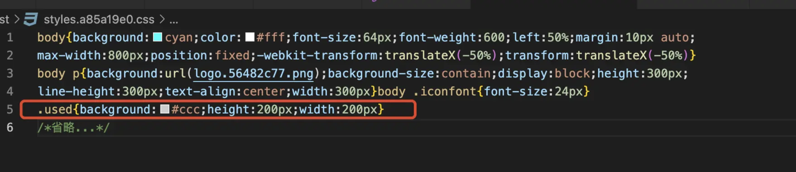

### <center>一更新文--假如了解webpack</center>
>  webpack is a static module bundler for modern JavaScript applications.

`复杂的情况下就是枯燥的兼容优化。`  
我对这个东西的了解仅存在于会配置...
**我还知道菜市场上比较多的loader,比如**
- `css-loader`
- `sass-loader， node-sass（编译sass的）`
-  `less-loader`
-  `postcss-loader（自动添加浏览器前缀的）`
-  `url-loader`解依赖 file-loader，当图片小于 limit 值的时候，会将图片转为 base64 编码，大于 limit 值的时候依然是使用 file-loader 进行拷贝
-  `file-loader`解决图片引入问题，并将图片 copy 到指定目录，默认为 dist
-  `img-loader`	压缩图片
-  `ts-loader`
-  `babel-loader @babel/core @babel/preset-env` es5以上版本转换为es5
-  `style-loader` 
-  `cache-loader`缓存一些性能开销比较大的 loader 的处理结果; 缓存地址（node_modules/.cache/cache-loader）
额 好像也就这点...  
**还有些插件**
- `html-webpack-plugin`
- 压缩js的插件， 
- 还有那个清空的插件`clean-webpack-plugin`  
- 哦哦哦 可能还要知道却换环境的一个工具， `cross-env`, 就是我们写在package.json里面的那个, `cross-env NODE_ENV=dev|prod|test|uat`
- `mini-css-extract-plugin`这个就是把css文件通过link的方式引用（原来直接就是style标签）
- `optimize-css-assets-webpack-plugin` 压缩css的
- `webpack-bundle-analyzer` 打包后查看大小的
- `speed-measure-webpack-plugin` 构建费时分析
#### Source Map
> 输入 => 转换器 => 输出，经过这一过程后，线上的代码已经被压缩或者混淆，虽然可能代码体积减小了，减少了网络开销，但是对于开发者调试来说确是无比痛苦的。压缩后的代码调试成了掉头发的难题。
一种反映射关系， 通过特殊的编码来实现，主要吧源代码分为组和段两个概念， 例如段用'；' 组用‘，’来表示，这样合成特殊编码

#### 项目优化
从宏观角度去分析项目进行优化， 
- 项目编写时
- 项目打包时候
  - 代码抽离
  - 利用cdn而非众多依赖增加开销
  - 
- 项目运行时候
  - 常见的首屏加载
  - 路由懒加载
  - 图片预加载、懒加载
  - 缓存
#### 构建速度优化
额... 就是无非按照人家提供的东西多去使用呗，避免我们把我们的习惯强加之勉。  
借鉴大佬之文。 [作者：ITEM](https://juejin.cn/post/7023242274876162084)  
- resolve 配置（公共路径）
   -  modules 告诉 webpack 解析模块时应该搜索的目录，常见配置如下
        ```js 
        const path = require('path');

        // 路径处理方法
        function resolve(dir){
            return path.join(__dirname, dir);
        }

        const config = {
            //...
            resolve: {
                modules: [resolve('src'), 'node_modules'],
            },
        };
        ///告诉 webpack 优先 src 目录下查找需要解析的文件，会大大节省查找时间
        ```
   - alias  
    alias 用的创建 import 或 require 的别名，用来简化模块引用，项目中基本都需要进行配置。
    ```js
      const path = require('path')
      ...
      // 路径处理方法
      function resolve(dir){
        return path.join(__dirname, dir);
      }

      const config  = {
        ...
        resolve:{
          // 配置别名
          alias: {
            '~': resolve('src'),
            '@': resolve('src'),
            'components': resolve('src/components'),
          }
        }
      };

    ```
   - extensions
      ```js
          const config = {
            //...
            resolve: {
              extensions: ['.js', '.json', '.wasm'],
            },
          }; 
      ``` 
      如果用户引入模块时不带扩展名，例如
      ```js
          import file from '../path/to/file';
      ```
      那么 webpack 就会按照 extensions 配置的数组从左到右的顺序去尝试解析模块  
        需要注意的是：  
        高频文件后缀名放前面；  
        1. 手动配置后，默认配置会被覆盖
        2. 如果想保留默认配置，可以用 ... 扩展运算符代表默认配置，例如
        ```js
          const config = {
            //...
            resolve: {
              extensions: ['.ts', '...'], 
            },
          };
        ```
    - modules 
    告诉 webpack 解析模块时应该搜索的目录，常见配置如下
    ```js
        const path = require('path');

        // 路径处理方法
        function resolve(dir){
          return path.join(__dirname, dir);
        }

        const config = {
          //...
          resolve: {
            modules: [resolve('src'), 'node_modules'],
          },
        }; 
    ```  
      告诉 webpack 优先 src 目录下查找需要解析的文件，会大大节省查找时间
- resolveLoader
     > 一般情况下， 你需要下载 各种各样的loader 来进行代码匹配处理规则，但 当我们要使用自己的开发的loader时， 总不能现发布一个npm包吧， 这就是一个连接器。
     这个就是加载本地的loder。
     ```js
     const path = require('path');

     // 路径处理方法
     function resolve(dir){
     return path.join(__dirname, dir);
     }

     const config = {
     //...
     resolveLoader: {
         modules: ['node_modules',resolve('loader')]
     },
     };

     ```
- externals
   > `externals` 配置选项提供了「从输出的 bundle 中排除依赖」的方法。此功能通常对 library 开发人员来说是最有用的，然而也会有各种各样的应用程序用到它。  

  - 例如，从 CDN 引入 jQuery，而不是把它打包：
     ```js
         // 引入
         <script
             src="https://code.jquery.com/jquery-3.1.0.js"
             integrity="sha256-slogkvB1K3VOkzAI8QITxV3VzpOnkeNVsKvtkYLMjfk="
             crossorigin="anonymous"
         ></script>
         // 配置
         const config = {
             //...
             externals: {
                 jquery: 'jQuery',
             },
         };

         // 使用
         import $ from 'jquery';
         $('.my-element').animate(/* ... */);
     ```
  - 更精准的使用
     > 在配置 loader 的时候，我们需要更精确的去指定 loader 的作用目录或者需要排除的目录，通过使用 include 和 exclude 两个配置项，可以实现这个功能，常见的例如：
     1. include：符合条件的模块进行解析
     2. exclude：排除符合条件的模块，不解析
     3. exclude 优先级更高
     ```js
         const path = require('path');
         // 路径处理方法
         function resolve(dir){
         return path.join(__dirname, dir);
         }

         const config = {
         //...
         module: { 
             noParse: /jquery|lodash/,
             rules: [
             {
                 test: /\.js$/i,
                 include: resolve('src'),
                 exclude: /node_modules/,
                 use: [
                 'babel-loader',
                 ]
             },
             // ...
             ]
         }
         };
     ``` 
  - noParse
    不需要解析依赖的第三方大型类库等，可以通过这个字段进行配置，以提高构建速度；使用 noParse 进行忽略的模块文件中不会解析 import、require 等语法
    ```js
     const config = {
     //...
     module: { 
         noParse: /jquery|lodash/,
         rules:[...]
     }

     };
    ``` 
- 多进程配置
   > 注意：实际上在小型项目中，开启多进程打包反而会增加时间成本，因为启动进程和进程间通信都会有一定开销。
   - thread-loader
     ```js
         // npm i -D  thread-loader 
         const path = require('path');

         // 路径处理方法
         function resolve(dir){
         return path.join(__dirname, dir);
         }

         const config = {
         //...
         module: { 
             noParse: /jquery|lodash/,
             rules: [
             {
                 test: /\.js$/i,
                 include: resolve('src'),
                 exclude: /node_modules/,
                 use: [
                 {
                     loader: 'thread-loader', // 开启多进程打包
                     options: {
                     worker: 3,
                     }
                 },
                 'babel-loader',
                 ]
             },
             // ...
             ]
         }
         };

     ``` 
   -  happypack
     > 同样为开启多进程打包的工具，webpack5 已弃用。  
- 利用缓存(利用缓存可以大幅提升重复构建的速度)
  -  babel-loader 开启缓存
     ```v
         babel 在转译 js 过程中时间开销比价大，将 babel-loader 的执行结果缓存起来，重新打包的时候，直接读取缓存
         缓存位置： node_modules/.cache/babel-loader
     ```  

     ```js
     const config = {
     module: { 
         noParse: /jquery|lodash/,
         rules: [
         {
             test: /\.js$/i,
             include: resolve('src'),
             exclude: /node_modules/,
             use: [
             // ...
             {
                 loader: 'babel-loader',
                 options: {
                 cacheDirectory: true // 启用缓存
                 }
             },
             ]
         },
         // ...
         ]
     }
     }
     ```
     那其他的 loader 如何将结果缓存呢？cache-loader 就可以帮我们完成这件事情
  -  cache-loader  
     ` npm i -D cache-loader `  
     ```js
     const config = {
     module: { 
         // ...
         rules: [
         {
             test: /\.(s[ac]|c)ss$/i, //匹配所有的 sass/scss/css 文件
             use: [
             // 'style-loader',
             MiniCssExtractPlugin.loader,
             'cache-loader', // 获取前面 loader 转换的结果
             'css-loader',
             'postcss-loader',
             'sass-loader', 
             ]
         }, 
         // ...
         ]
     }
     }

     ```
  - hard-source-webpack-plugin
   > hard-source-webpack-plugin 为模块提供了中间缓存，重复构建时间大约可以减少 80%，但是在 webpack5 中已经内置了模块缓存，不需要再使用此插件 
  -  cache 持久化缓存
     通过配置 cache 缓存生成的 webpack 模块和 chunk，来改善构建速度。
     ```js
       const config = {
         cache: {
           type: 'filesystem',
         },
       };
     ``` 
  - 
#### 优化构建结果
 - 构建结果分析
   借助插件 webpack-bundle-analyzer 我们可以直观的看到打包结果中，文件的体积大小、各模块依赖关系、文件是够重复等问题，极大的方便我们在进行项目优化的时候，进行问题诊断。
   ``` js
      // 安装 npm i -D webpack-bundle-analyzer

      // 引入插件
      const BundleAnalyzerPlugin = require('webpack-bundle-analyzer').BundleAnalyzerPlugin


      const config = {
        // ...
        plugins:[ 
          // ...
          // 配置插件 
          new BundleAnalyzerPlugin({
            // analyzerMode: 'disabled',  // 不启动展示打包报告的http服务器
            // generateStatsFile: true, // 是否生成stats.json文件
          })
        ],
      };

      // 修改启动命令
      "scripts": {
          // ...
          "analyzer": "cross-env NODE_ENV=prod webpack --progress --mode production"
        },

      // 执行 npm run analyzer

      // 如果，我们只想保留数据不想启动 web 服务，这个时候，我们可以加上两个配置

      new BundleAnalyzerPlugin({
        analyzerMode: 'disabled',  // 不启动展示打包报告的http服务器
        generateStatsFile: true, // 是否生成stats.json文件
      })
   ``` 
 - 压缩 CSS
   1. 安装 optimize-css-assets-webpack-plugin
   2. 修改 webapck.config.js 配置
      ```js
        const OptimizeCssAssetsPlugin = require('optimize-css-assets-webpack-plugin')
        // ...

        const config = {
          // ...
          optimization: {
            minimize: true,
            minimizer: [
              // 添加 css 压缩配置
              new OptimizeCssAssetsPlugin({}),
            ]
          },
        // ...
        }
      ```    
 - 压缩 JS
   在生成环境下打包默认会开启 js 压缩，但是当我们手动配置 optimization 选项之后，就不再默认对 js 进行压缩，需要我们手动去配置。
   因为 webpack5 内置了`terser-webpack-plugin` 插件，所以我们不需重复安装，直接引用就可以了，具体配置如下
   ```js
      const TerserPlugin = require('terser-webpack-plugin');

      const config = {
        // ...
        optimization: {
          minimize: true, // 开启最小化
          minimizer: [
            // ...
            new TerserPlugin({})
          ]
        },
        // ...
      }
   ``` 
 - 清楚无用css
   purgecss-webpack-plugin 会单独提取 CSS 并清除用不到的 CSS
   1. 安装插件 `npm i -D purgecss-webpack-plugin`
   2. 添加配置
      ```js
        const PurgecssWebpackPlugin = require('purgecss-webpack-plugin')
        const glob = require('glob'); // 文件匹配模式

        function resolve(dir){
          return path.join(__dirname, dir);
        }

        const PATHS = {
          src: resolve('src')
        }

        const config = {
          plugins:[ // 配置插件
            // ...
            new PurgecssPlugin({
              paths: glob.sync(`${PATHS.src}/**/*`, {nodir: true})
            }),
          ]
      ``` 
      index.html 新增节点  
      ```html
        <head>
          <meta charset="UTF-8">
          <meta http-equiv="X-UA-Compatible" content="IE=edge">
          <meta name="viewport" content="width=device-width, initial-scale=1.0">
          <title>ITEM</title>
        </head>
        <body>
          <p></p>
          <!-- 使用字体图标文件 -->
          <i class="iconfont icon-member"></i>
          <div id="imgBox"></div>
          
          <!-- 新增 div，设置 class 为 used -->
          <div class="used"></div>
        </body>
        </html>
      ```

      ```scss
        .used {
          width: 200px;
          height: 200px;
          background: #ccc;
        }

        .unused {
          background: chocolate;
        }
      ```

      打包 
      我们可以看到只有 .used 被保存下来
      如何证明是这个插件的作用呢？注释掉再打包就可以看到，.unused 也会被打包进去，由此可证...
 - tree-shaking
   Tree-shaking 作用是剔除没有使用的代码，以降低包的体积  
   `webpack 默认支持，需要在 .bablerc 里面设置 model：false，即可在生产环境下默认开启`  
   ```js
      module.exports = {
        presets: [
          [
            "@babel/preset-env",
            {
              module: false,
              useBuiltIns: "entry",
              corejs: "3.9.1",
              targets: {
                chrome: "58",
                ie: "11",
              },
            },
          ],
        ],
        plugins: [    
          ["@babel/plugin-proposal-decorators", { legacy: true }],
          ["@babel/plugin-proposal-class-properties", { loose: true }],
        ]
      };
   ```
 - scope-hoisting
   Scope Hoisting 即作用域提升，原理是将多个模块放在同一个作用域下，并重命名防止命名冲突，通过这种方式可以减少函数声明和内存开销。
    - webpack 默认支持，在生产环境下默认开启
    - 只支持 es6 代码
####  优化运行时体验
1. 多入口
2. splitChunks 分包配置
   optimization.splitChunks 是基于 SplitChunksPlugin 插件实现的 
   > SplitChunksPlugin插件是什么呢，简单的来说就是Webpack中一个提取或分离代码的插件，主要作用是提取公共代码，防止代码被重复打包，拆分过大的js文件，合并零散的js文件。

   默认情况下，它只会影响到按需加载的 chunks，因为修改 initial chunks 会影响到项目的 HTML 文件中的脚本标签。  
   webpack 将根据以下条件自动拆分 chunks：
      1. 新的 chunk 可以被共享，或者模块来自于 node_modules 文件夹
      2. 新的 chunk 体积大于 20kb（在进行 min+gz 之前的体积）
      3. 当按需加载 chunks 时，并行请求的最大数量小于或等于 30
      4. 当加载初始化页面时，并发请求的最大数量小于或等于 30
      - 默认配置介绍
        ```js
        module.exports = {
          //...
          optimization: {
            splitChunks: {
              chunks: 'async', // 有效值为 `all`，`async` 和 `initial`
              minSize: 20000, // 生成 chunk 的最小体积（≈ 20kb)
              minRemainingSize: 0, // 确保拆分后剩余的最小 chunk 体积超过限制来避免大小为零的模块
              minChunks: 1, // 拆分前必须共享模块的最小 chunks 数。
              maxAsyncRequests: 30, // 最大的按需(异步)加载次数
              maxInitialRequests: 30, // 打包后的入口文件加载时，还能同时加载js文件的数量（包括入口文件）
              enforceSizeThreshold: 50000,
              cacheGroups: { // 配置提取模块的方案
                defaultVendors: {
                  test: /[\/]node_modules[\/]/,
                  priority: -10,
                  reuseExistingChunk: true,
                },
                default: {
                  minChunks: 2,
                  priority: -20,
                  reuseExistingChunk: true,
                },
              },
            },
          },
        };

        ``` 
      - 项目中的使用
        ```js
          const config = {
            //...
            optimization: {
              splitChunks: {
                cacheGroups: { // 配置提取模块的方案
                  default: false,
                  styles: {
                      name: 'styles',
                      test: /\.(s?css|less|sass)$/,
                      chunks: 'all',
                      enforce: true,
                      priority: 10,
                    },
                    common: {
                      name: 'chunk-common',
                      chunks: 'all',
                      minChunks: 2,
                      maxInitialRequests: 5,
                      minSize: 0,
                      priority: 1,
                      enforce: true,
                      reuseExistingChunk: true,
                    },
                    vendors: {
                      name: 'chunk-vendors',
                      test: /[\\/]node_modules[\\/]/,
                      chunks: 'all',
                      priority: 2,
                      enforce: true,
                      reuseExistingChunk: true,
                    },
                  // ... 根据不同项目再细化拆分内容
                },
              },
            },
          }

        ``` 
      - 代码懒加载
        核心`import()`
        ```js
        // img.js
          const img = document.createElement('img')
          img.src = '...'
          module.exports = img
        // home.js
        const div = document.createElement('div');
        div.textContent = '我'
        div.addEventListener('click', () => {
          import('./img').then(({ default: element }) => {
            console.log(element)
            document.body.appendChild(element)
          })
        })
        ``` 
      - prefetch与preload
        上面我们使用异步加载的方式引入图片的描述，但是如果需要异步加载的文件比较大时，在点击的时候去加载也会影响到我们的体验，这个时候我们就可以考虑使用 prefetch 来进行预拉取
        -  prefetch (预获取)：浏览器空闲的时候进行资源的拉取
            改造一下上面的代码
            ```js
               div.addEventListener('click', () => {
                  import(/* webpackPrefetch: true */ './img').then(({ default: element }) => {
                    console.log(element)
                    document.body.appendChild(element)
                  })
                })
            ```
        -  preload(预加载)：提前加载后面会用到的关键资源
            `import(/* webpackPreload: true */ 'ChartingLibrary');`  
#### 多入口打包  
1. 配置entry对象
   ```js
   // 多个入口
    module.exports = {
      entry: {
        'page1': './src/pages/page1/app.js', // 页面1
        'page2': './src/pages/page2/app.js', // 页面2
      },
      output: {
        path: path.resolve(__dirname, './dist'),
        filename: 'js/[name]/[name]-bundle.js', // filename不能写死，只能通过[name]获取bundle的名字
      }
    }
    // 多个页面 
    module.exports = {
      plugins: [
        new HtmlWebpackPlugin(
        {
          template: './src/pages/page1/index.html',
          chunks: ['page1'],
        }
      ),
      new HtmlWebpackPlugin(
        {
          template: './src/pages/page2/index.html',
          chunks: ['page2'],
        }
      ),
      ]
    }
     //  公共代码 
    module.exports = {
      optimization: {
        splitChunks: {
          cacheGroups: {
            // 打包业务中公共代码
            common: {
              name: "common",
              chunks: "initial",
              minSize: 1,
              priority: 0,
              minChunks: 2, // 同时引用了2次才打包
            },
            // 打包第三方库的文件
            vendor: {
              name: "vendor",
              test: /[\\/]node_modules[\\/]/,
              chunks: "initial",
              priority: 10,
              minChunks: 2, // 同时引用了2次才打包
            }
          }
        },
        runtimeChunk: { name: 'manifest' } // 运行时代码
      }
    }
   ```
2. 返回数组
  webpack.config.js 返回一个数据配置
  ```js
    let enterys = ['page1', 'page2']
    module.exports = enterys.map(item => {
      return { 
          entry: './src/'+item+'.js',
          output: {
            filename: `js/${item}.js`
          },
          plugins: [
            new HtmlWebpackPlugin({
              filename: `${item}.html`
            })
          ]
      }
    })
  ```
#### Hash值
| 占位符      | 解释                                                                                   |
| ----------- | -------------------------------------------------------------------------------------- |
| ext         | 文件后缀名                                                                             |
| name        | 文件名                                                                                 |
| path        | 文件相对路径                                                                           |
| folder      | 文件所在文件夹                                                                         |
| hash        | 每次构建生成的唯一 hash 值; 任何一个文件改动，整个项目的构建 hash 值都会改变；         |
| chunkhash   | 根据 chunk 生成 hash 值 ;文件的改动只会影响其所在 chunk 的 hash 值；                   |
| contenthash | 根据文件内容生成hash 值;每个文件都有单独的 hash 值，文件的改动只会影响自身的 hash 值； |


#### Webpack5资源模块
内置了资源处理模块，file-loader 和 url-loader 都可以不用安装
> webpack5 新增资源模块(asset module)，允许使用资源文件（字体，图标等）而无需配置额外的 loader。

资源模块支持以下四个配置：
>- asset/resource 将资源分割为单独的文件，并导出 url，类似之前的 file-loader 的功能.
>- asset/inline 将资源导出为 dataUrl 的形式，类似之前的 url-loader 的小于 limit 参数时功能.
>- asset/source 将资源导出为源码（source code）. 类似的 raw-loader 功能.
>- asset 会根据文件大小来选择使用哪种类型，当文件小于 8 KB（默认） 的时候会使用 asset/inline，否则会使用 asset/resource
```js
// ./src/index.js

const config = {
  // ...
  module: { 
    rules: [
      // ... 
      {
        test: /\.(jpe?g|png|gif)$/i,
        type: 'asset',
        generator: {
          // 输出文件位置以及文件名
          // [ext] 自带 "." 这个与 url-loader 配置不同
          filename: "[name][hash:8][ext]"
        },
        parser: {
          dataUrlCondition: {
            maxSize: 50 * 1024 //超过50kb不转 base64
          }
        }
      },
      {
        test: /\.(woff2?|eot|ttf|otf)(\?.*)?$/i,
        type: 'asset',
        generator: {
          // 输出文件位置以及文件名
          filename: "[name][hash:8][ext]"
        },
        parser: {
          dataUrlCondition: {
            maxSize: 10 * 1024 // 超过100kb不转 base64
          }
        }
      },
    ]
  },
  // ...
}

module.exports = (env, argv) => {
  console.log('argv.mode=',argv.mode) // 打印 mode(模式) 值
  // 这里可以通过不同的模式修改 config 配置
  return config;
}

```


### interview Question
- Webpack 配置中用过哪些 Loader ？都有什么作用？
- Webpack 配置中用过哪些 Plugin ？都有什么作用？
- Loader 和 Plugin 有什么区别？
- 如何编写 Loader ? 介绍一下思路？❗️❗️❗️
- 如何编写 Plugin ? 介绍一下思路？❗️❗️❗️
- Webpack optimize 有配置过吗？可以简单说说吗？❗️❗️❗️
- Webpack 层面如何性能优化？
- Webpack 打包流程是怎样的？
- tree-shaking 实现原理是怎样的？❗️❗️❗️
- Webpack 热更新（HMR）是如何实现？
- Webpack 打包中 Babel 插件是如何工作的？❗️❗️❗️
- Webpack 和 Rollup 有什么相同点与不同点？❗️❗️❗️
- Webpack5 更新了哪些新特性？❗️❗️❗️
- webpack 的构建流程是什么
- webpack 打包时hash码是如何生成的❗️❗️❗️
- webpack 离线缓存静态资源如何实现❗️❗️❗️


### 参见
- [作者：ITEM](https://juejin.cn/post/7023242274876162084)